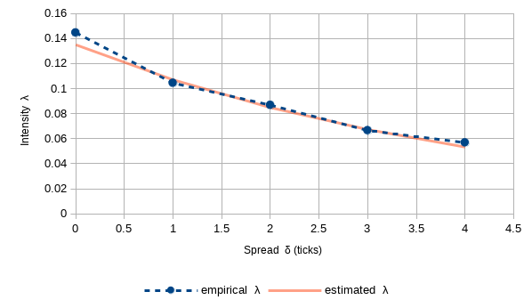

# Poisson intensity of limit order execution, calibration of parameters A and k using level 1 tick data  

## Description

A limit order placed at a price *S<sub>t</sub> ± δ*, has the instantaneous probability of execution *λ(δ)dt* where the intensity *λ(δ)* is given by:

  *λ(δ) = A e<sup> -kδ</sup>*    
  
*λ* - Poisson order execution intensity  
*δ* - spread (distance from mid price *S<sub>t</sub>*)  
*A* - parameter, positively related to trading intensity  
*k* - parameter, positively related to market depth  

Package Execution Intensity Estimator (EIE) contains single and multi threaded calibration procedure of *A* and *k* parameters. 
Methods that calculate  intensity *λ(δ, A, k)* and spread *δ(λ, A, k)* are provided as well.
Algorithm operates on level 1 tick data, therefore it is suitable in a setting where liquidity is not fully observable (i.e. dark pools). 
Calibration is two step procedure performed separately for buy and sell limit orders.     
<br>**Steps:**  
- For each spread *δ<sub>k</sub>* of *N* predefined spreads *(δ<sub>0</sub> , δ<sub>1</sub> , δ<sub>2</sub> , ... δ<sub>N-1</sub>)* 
estimate execution intensity *λ(δ<sub>k</sub>)* using "waiting time" approach described in [[1]](#references) 4.4.2.. 
Result of this step is set of *N* points *(δ<sub>k</sub> , λ(δ<sub>k</sub>))* on empirical Spread Intensity Curve (SIC)  
- Estimate *A* and *k* based on *N* points from previous step. This can be achieved by various approaches. 
Code implements two approaches described in [[2]](#references) 3.2:    
    - ***LOG_REGRESSION***  performs OLS regression of *log(λ<sub>k</sub>)* on *δ<sub>k</sub>*. Finally *k = -slope* and *A = e<sup> intercept</sup>*  
    - ***MULTI_CURVE***  from set of *N* points creates *N<sub>s</sub> = (N\*(N-1))/2* unique pairs fo points *((δ<sub>x</sub> , λ<sub>x</sub>) , (δ<sub>y</sub> , λ<sub>y</sub>))*.
      For each set of points solves the following set of equations for *A'* and *k'* :   
       *λ<sub>x</sub> = A' e<sup> -k'δ<sub>x</sub></sup>*          
       *λ<sub>y</sub> = A' e<sup> -k'δ<sub>y</sub></sup>*         
      Final estimates are *A = mean(A'<sub>1</sub> , A'<sub>2</sub> , ... A'<sub>N<sub>s</sub></sub>)* and *k = mean(k'<sub>1</sub> , k'<sub>2</sub> , ... k'<sub>N<sub>s</sub></sub>)*   
      
Once *A* and *k* are calibrated, depending on context of usage, user can specify:
- spread *δ* to obtain corresponding intensity *λ(δ)*
- intensity *λ* to obtain corresponding spread *δ(λ)*  
<br><br>
 


## Usage

- Configuration parameters   
```
    double spreadStep = 0.00001;  // increment of spread, greater than or equal to tick size
    int nSpreads  = 10; // number of spread increments, greater than 2
    long w = 3600000; // 60 min,  width of estimators sliding window
    long dt = 10000 //  10 seconds, time scaling
``` 
- Create an instance of AkSolverFactory and specify SolverType
- Create an instance of FillRateEstimator
```  
    AkSolverFactory sf = new AkSolverFactory(SolverType.MULTI_CURVE);    
    IntensityEstimator ie = new IntensityEstimator(spreadStep, nSpreads, w, dt, sf);
 ```    
- Pass an instance of ExecutorService to EstimationExecutor. Ensure minimum number of 5 threads is available.
This step is required only for multithreaded estimation. 
```   
    EstimationExecutor.setExecutor(executorService);  
```
- Pass data (bid, ask, timestamp) to the instance of FillRateEstimator with onTick/onTickAsync call
- Run parameter estimates with estimate/estimateAsync call

```
    while(loop){
        ...
        // pass tick data to estimator
        Future<Boolean> tickResult = ie.onTickAsync(bid, ask, timeStamp);
        ...

        if (tickResult.get()) { // check if estimator can be called            
            Future<IntensityInfo> result = ie.estimateAsync(timeStamp);
            ...
            
            IntensityInfo intensityInfo =result.get();
            ...
 ```           
- Returned IntensityInfo instance gives access to parameters A and k for both buy and sell orders.
 Intensities *λ(δ)* and Spreads *δ(λ)* are returned by corresponding public methods.
 
***Note:***
   
- More details on usage and configuration can be found in IntensityEstimatorTest and javadoc comments 
- Detailed test output is saved to target/intensity-log/ folder
- Single threaded outperforms multithreaded execution when less complex configurations are used


### References
- [[1] Fernandez-Tapia, Joaquin. (2015). Modeling, optimization and estimation for the on-line control of trading algorithms in limit-order markets. 10.13140/RG.2.1.1490.5684. ](https://pdfs.semanticscholar.org/20e5/e8364a48ef9d4b25fbf7d6e0892bf4baa265.pdf)
 
- [[2] Sophie Laruelle, Faisabilité de l’apprentissage des paramètres d’un algorithme de trading sur des données réelles](http://events.chairefdd.org/wp-content/uploads/2013/06/CAHIER_MICRO_1.pdf)
 